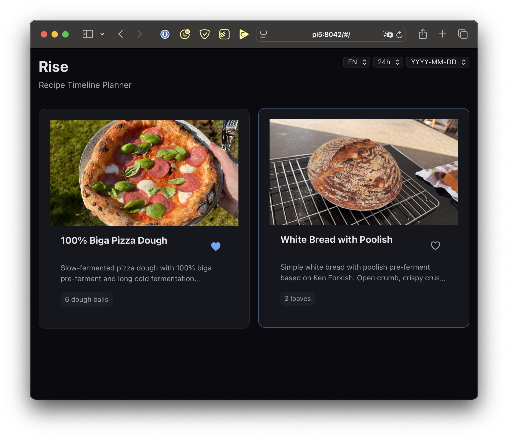
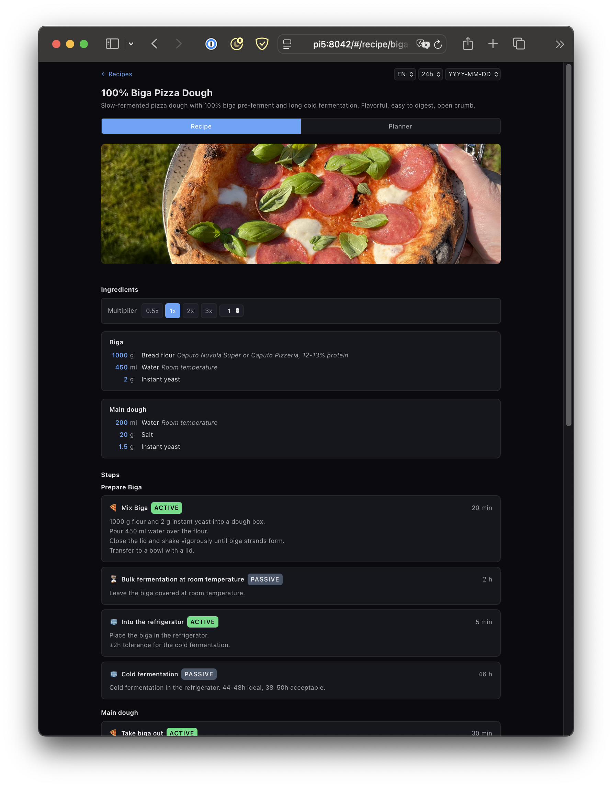
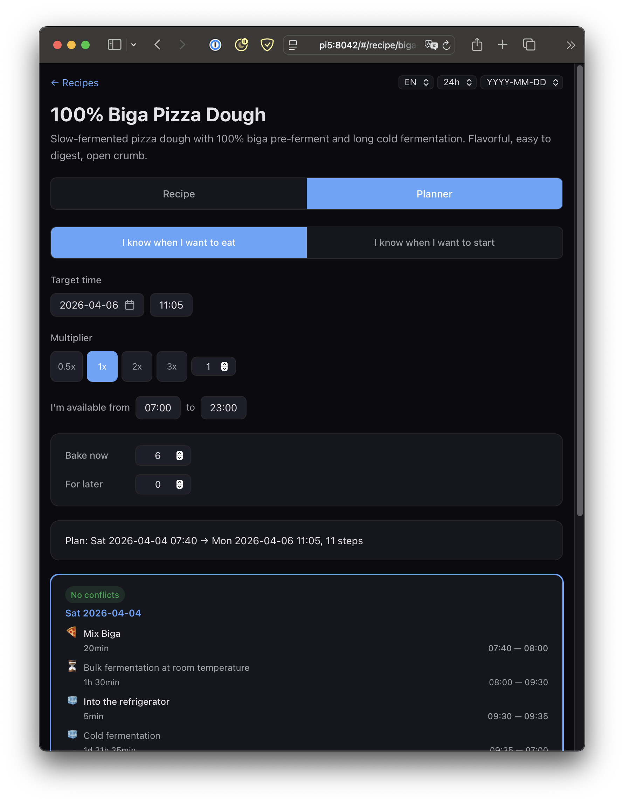

# Rise

A self-hosted recipe timeline planner that helps you plan complex, multi-day recipes. Define recipes as JSON, get a schedule overview with plan variants, and export to your calendar.

Built in an afternoon with [Claude Code](https://claude.ai/code). The fact that this exists at all is a bit absurd, but maybe someone out there is equally bad at planning when to start a 3-day bread recipe.







## Features

- Schedule overview with conflict-free plan variants
- Forward/backward scheduling from target time
- Flexible step durations with automatic unsocial-hours avoidance
- ICS calendar export with alarms
- Surplus handling (fridge, freeze, par-bake)
- Ingredient scaling with multiplier
- Optional steps and ingredients
- Mobile-first, responsive, dark mode
- Self-hosted, no accounts, no database
- Multilingual (English + German, extensible)

## Quick Start

```bash
# Clone
git clone https://github.com/alexbartok/rise.git
cd rise

# Backend
cd backend
python3 -m venv .venv
source .venv/bin/activate
pip install -r requirements.txt
uvicorn main:app --reload --port 8000

# Frontend (new terminal)
cd frontend
npm install
npm run dev
```

Open http://localhost:5173

## Production Deployment

### Docker (recommended)

```bash
docker compose up --build -d
```

The included `Dockerfile` builds the Svelte frontend, bundles it with the FastAPI backend, and serves everything from a single container. `docker-compose.yml` maps port 8042 and mounts `recipes/` as a volume so you can edit recipes without rebuilding.

### Without Docker

```bash
cd frontend && npm run build
cd ../backend
uvicorn main:app --host 0.0.0.0 --port 8000
```

In production the FastAPI backend serves the built Svelte frontend as static files, so a single `uvicorn` process is all you need.

- **Raspberry Pi** -- same steps work on ARM (Docker or direct).
- **Synology NAS** -- use Docker or run directly with the bundled Python interpreter.

## Adding Recipes

1. Create a folder under `recipes/` (e.g. `recipes/my-sourdough/`)
2. Add `recipe.json` following the [Recipe Format Guide](docs/recipe-format.md)
3. Optionally add images in `recipes/my-sourdough/images/`
4. Optionally add translations as `recipe.en.json`, `recipe.de.json`, etc. (see [Localization](docs/recipe-format.md#localization))
5. Recipes appear automatically in the app

## Tech Stack

- **Frontend:** Svelte 4 + Vite
- **Backend:** FastAPI + Pydantic
- **Calendar:** ICS (client-side)

## License

MIT
